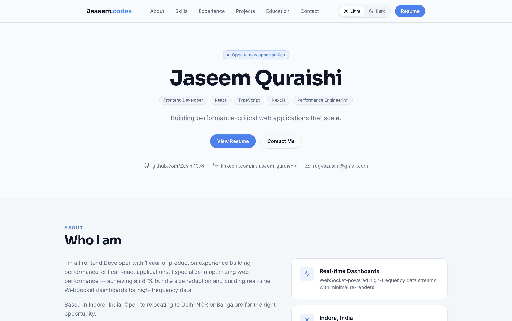
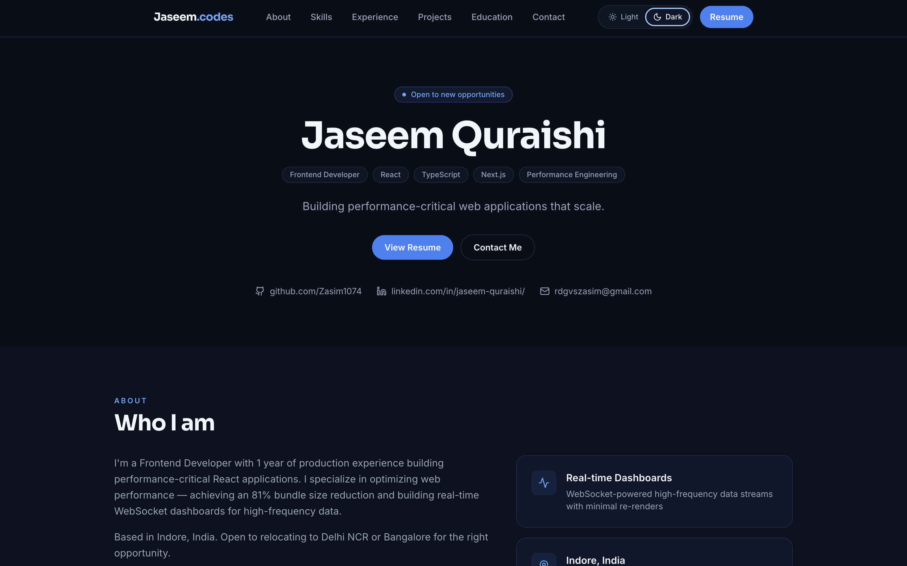

# Jaseem Quraishi — Portfolio

🚀 **Live:** https://jaseem-codes.vercel.app/

---

## 🧠 Overview

This is my personal portfolio built to showcase my work as a **Frontend Developer (React)**.

The focus is not just UI, but:
- Clean architecture
- Smooth user experience
- Performance-conscious design

---

## ⚙️ Tech Stack

- **Frontend:** React (Vite), JavaScript (ES6+)
- **Styling:** SCSS (modular & structured)
- **Deployment:** Vercel
- **Design Focus:** Responsive + modern UI patterns

---

## ✨ Key Features

- Fully responsive (mobile-first approach)
- Smooth hover and transition animations
- Project showcase with live demos
- Resume download (PDF)
- Clean and minimal UI

---

## 🧩 Featured Projects

### 🔹 TrackHire
Job application tracking platform — manage applications, track interview stages, and stay organized throughout a job search.


### 🔹 Hotel Sanwariya
A modern hospitality website featuring room showcases, amenities, gallery, booking inquiries, SEO optimization, & a fully responsive design


### 🔹 Code Book
Browser-based code editor and snippet manager for writing, running, and reusing code.

---

## 🏗️ Architecture & Decisions

### Why Vite?
- Faster dev server and build times
- Better DX compared to CRA

### Why SCSS?
- Cleaner structure than plain CSS
- Easier nesting and maintainability

### Component Design
- Reusable components
- Separation of UI and data (helper files for project data)

---

## ⚡ Performance Considerations

- Optimized image rendering
- Minimal re-renders with clean component structure
- Lightweight bundle using Vite

---

## 📸 Preview - Light Mode



## 📸 Preview - Dark Mode



---

## 🛠️ Getting Started

```bash
git clone https://github.com/Zasim1074/portfolio.git
cd portfolio
npm install
npm run dev
```